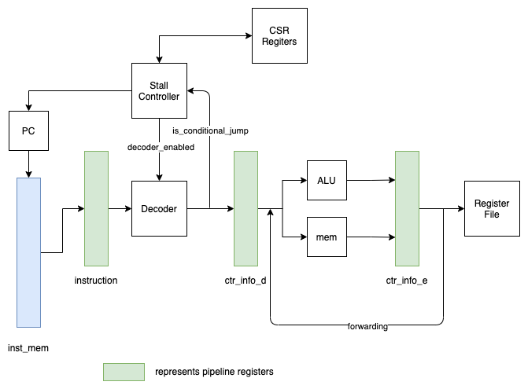

# RISC-V-core

This repository is my RISC-V processor.
My implementation is in /src and the version for blog post (https://yoshi-ki.medium.com) is in /practice-files

## Overview
### ISA
RISC-V 32 im + privileged instruction (mret)  
Based on the documents provided by RISC-V project (https://riscv.org)


### Characters of this architecture
- Architecture Image

- Pipeline
  - 4-stage pipeline: Fetch -> Decode -> Execute -> Write
- Machine Mode
  - User-Mode + Machine-Mode
- Memory
  - 1024 entries
  - 32 bit
  - Memory is implemented by using registers in Verilog for simplicity
- Registers
  - 32 registers
  - 32 bit
  - usage is same as the table below.
  - CSR registers are simply implemented for MRET instruction test.

Register  | ABI         | Use by convention                     
:-------- | :---------- | :---------------                      
x0        | zero        | hardwired to 0, ignores writes        
x1        | ra          | return address for jumps              
x2        | sp          | stack pointer                         
x3        | gp          | global pointer                        
x4        | tp          | thread pointer                        
x5        | t0          | temporary register 0                  
x6        | t1          | temporary register 1                  
x7        | t2          | temporary register 2                  
x8        | s0 _or_ fp  | saved register 0 _or_ frame pointer   
x9        | s1          | saved register 1                      
x10       | a0          | return value _or_ function argument 0 
x11       | a1          | return value _or_ function argument 1 
x12       | a2          | function argument 2                   
x13       | a3          | function argument 3                   
x14       | a4          | function argument 4                   
x15       | a5          | function argument 5                   
x16       | a6          | function argument 6                   
x17       | a7          | function argument 7                   
x18       | s2          | saved register 2                      
x19       | s3          | saved register 3                      
x20       | s4          | saved register 4                      
x21       | s5          | saved register 5                      
x22       | s6          | saved register 6                      
x23       | s7          | saved register 7                      
x24       | s8          | saved register 8                      
x25       | s9          | saved register 9                      
x26       | s10         | saved register 10                     
x27       | s11         | saved register 11                     
x28       | t3          | temporary register 3                  
x29       | t4          | temporary register 4                  
x30       | t5          | temporary register 5                  
x31       | t6          | temporary register 6                  

Registers of the RV32I. Based on RISC-V documentation and Patterson and Waterman "The RISC-V Reader" (2017)

## Compiler Installation & Run
For installation of the RISC-V compiler, please check [my blog](https://yoshi-ki.medium.com/create-risc-v-core-using-verilog-hdl-1-setting-up-a-risc-v-cross-compiler-f0b2f8d57ca1).
This blog also covers how to run the compiler.

## Installation and Run Simulation
Once you got the compiled machine code, you can use my processor to process the code. 

1. Please clone this repository and move to the src directory.  
  `git clone https://github.com/yoshi-ki/RISC-V-core`  
  `cd src/`
2. Please modify the following two to run your code.  
  Modify final_pc and inst_mem_size in line 13 and 15 of [cpu.sv](/src/cpu.sv) to the number of lines of your code.  
  Modify the contents in inst_mem in line 42 of [cpu.sv](/src/cpu.sv) to your compiled binary.
3. Run ./simulation.sh to do the simulation.


## Wave Check by Vivado
You may want to use the vivado wave simulator to check the movement of the architecture precisely. For the wave check, please check [my blog about how to use the vivado simulator](https://yoshi-ki.medium.com/create-risc-v-core-using-verilog-hdl-3-simulation-tools-3a3f30f5b62e).

## Examples
Runnig ./simulation.sh in this code will execute fib(12). The below is the result of the execution.
"clocks" represents the number of clocks and r00 - r31 represent the registers after execution.
```
clocks: 26523
     r00:    0,     r01:   36,     r02:  484,     r03:    0,
     r04:    0,     r05:    0,     r06:    0,     r07:    0,
     r08:  500,     r09:    0,     r10:  233,     r11:    0,
     r12:    0,     r13:    0,     r14:    0,     r15:  233,
     r16:    0,     r17:    0,     r18:    0,     r19:    0,
     r20:    0,     r21:    0,     r22:    0,     r23:    0,
     r24:    0,     r25:    0,     r26:    0,     r27:    0,
     r28:    0,     r29:    0,     r30:    0,     r31:    0,
```


## Privileged Version Example Code
Please see [this branch](https://github.com/yoshi-ki/RISC-V-core/tree/privileged_finish) to check privileged instructions.


## About Practice files for My Blog

/ver1: This core can execute add.

/ver2: This core can execute almost all of the rv32i instructions (not tested yet)

/ver3: Start implementing easy memory using registers (plan to make fibonacci executable)

/ver4: finish implemetation of instructions for fibonacci

/ver5: pipelined version
